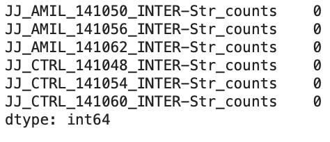
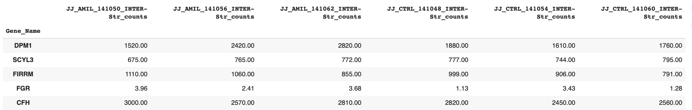
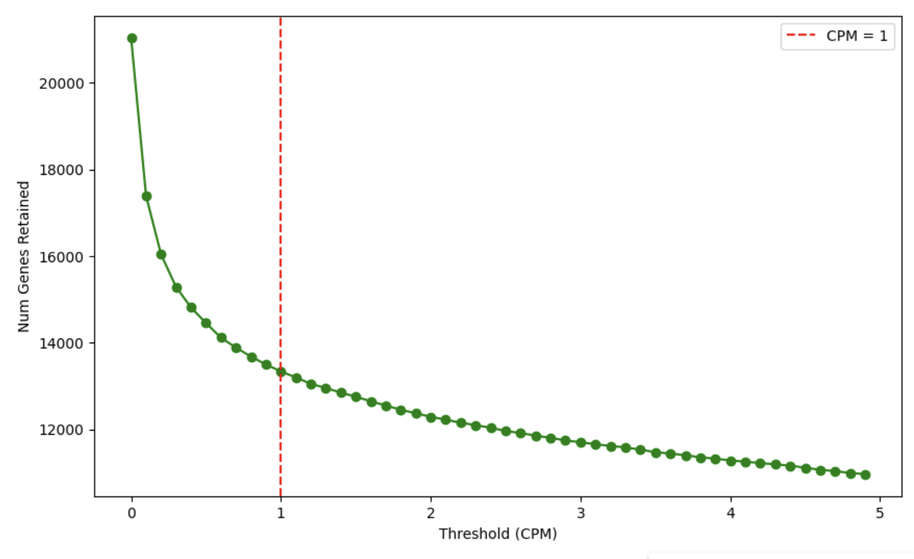
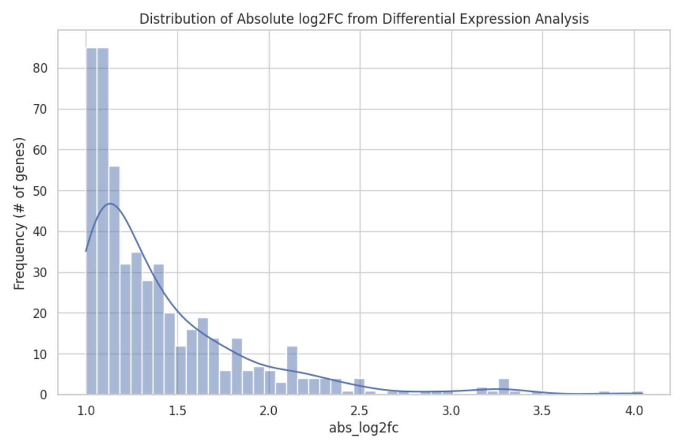
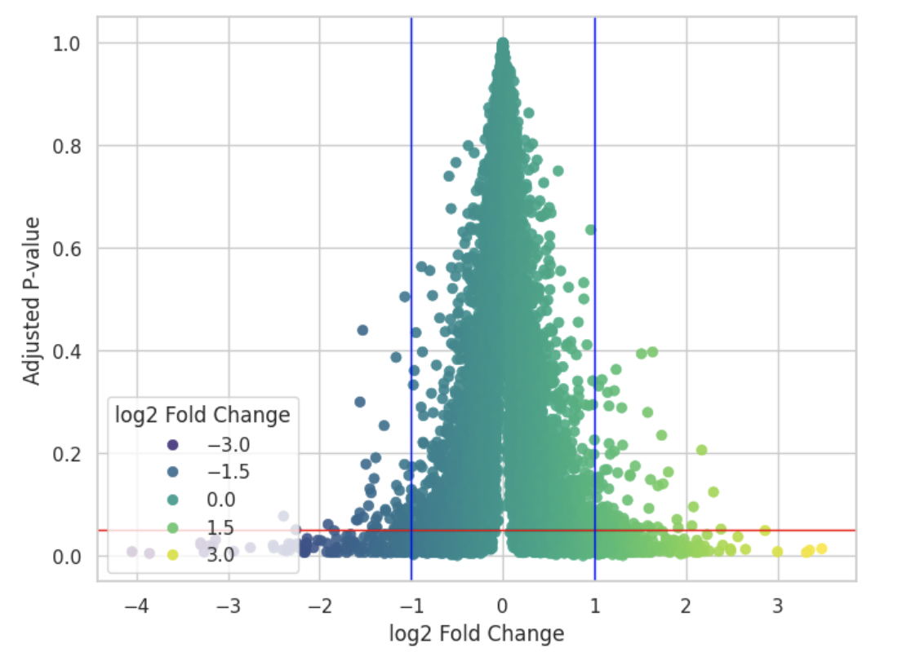
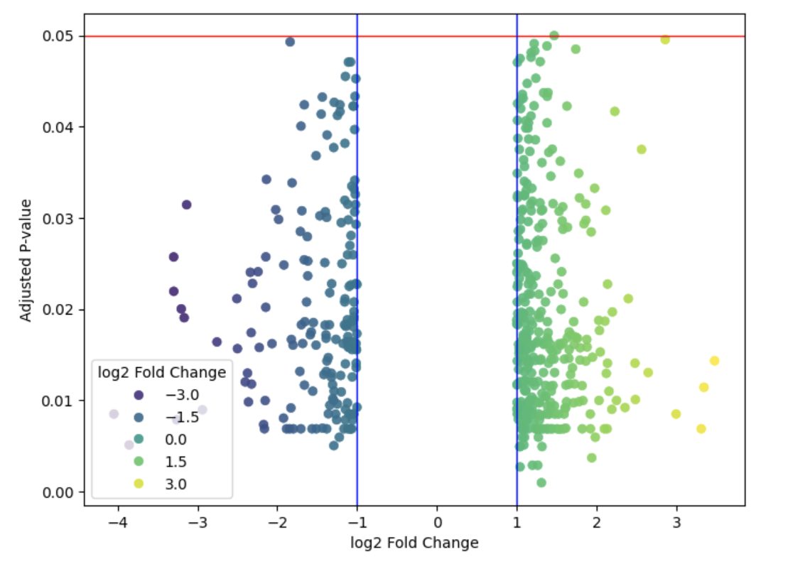
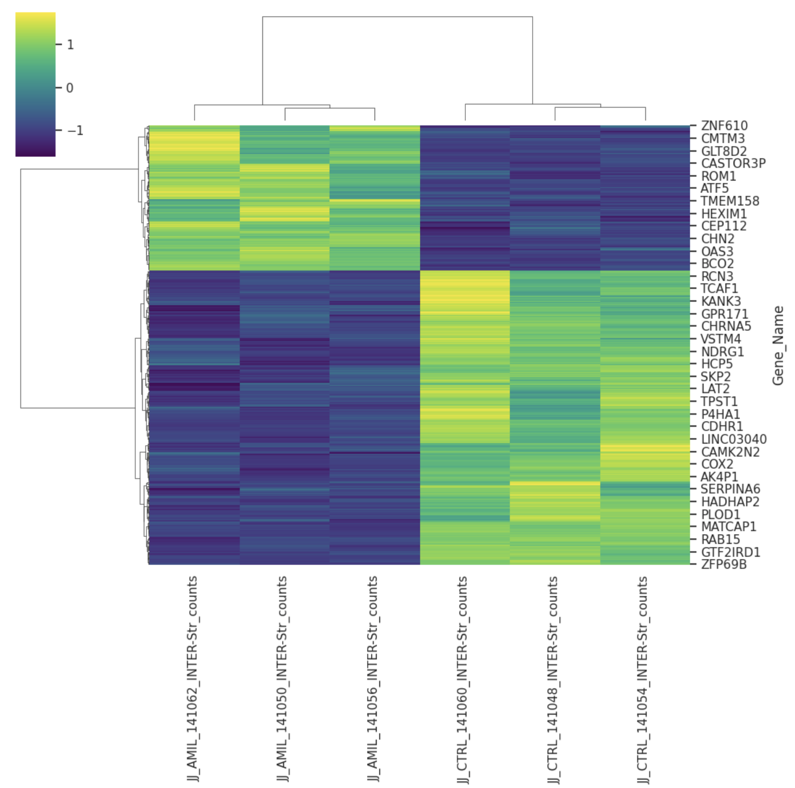
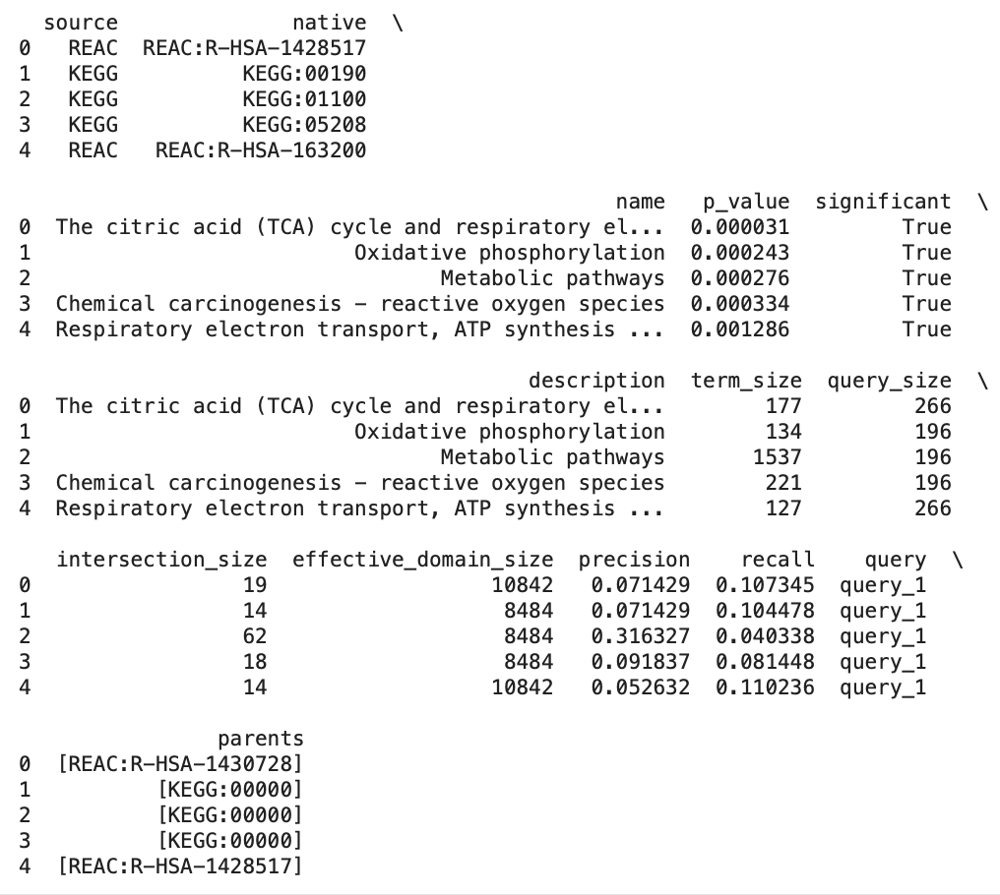
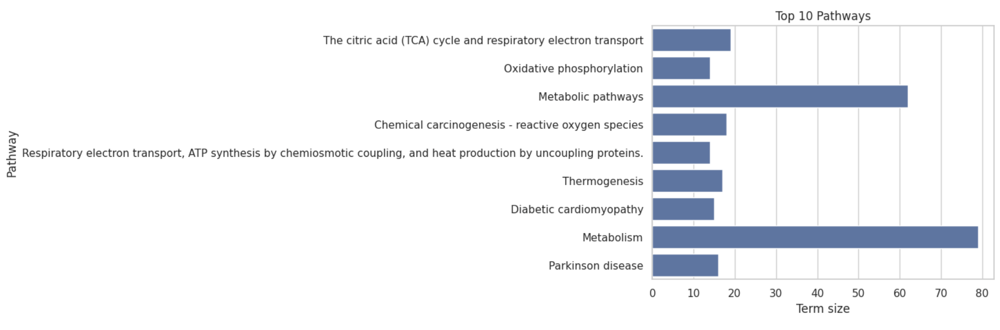

# 🧫 Project Introduction

In this project repository I'll be analyzing RNA-sequencing data from a study titled, Amiloride, [An Old Diuretic Drug, Is a Potential Therapeutic Agent for Multiple Myeloma](https://aacrjournals.org/clincancerres/article/23/21/6602/259285/Amiloride-An-Old-Diuretic-Drug-Is-a-Potential)[1]. 

In this study, myeloma cell lines and a xenograft mouse model (i.e., a mouse with human tumor cells implanted in it) were used to evaluate the drug amiloride's toxicity (i.e., cell-killing effects). Additionally, amilioride's mechanism of action was investigated using RNA-Seq experiments, qRT-PCR, immunoblotting, and immunofluorescence assays.

The investigators in this study found amiloride-induced apoptosis in a broad panel of multiple myeloma cell lines and in the xenograft mouse model. Additionally, they found that amiloride has a synergistic effect when combined with other drugs, such as dexamethasone and melphalan.

In this project repository, I will analyze the RNA-sequencing data from this study, made available via the Gene Expression Omnibus (GEO), to better understand amiloride's mechanism of action and effects, with special attention dedicated to analyzing differentially expressed genes and their physiological functions. If you're unfamiliar with differential expression analysis and how it works, I recommend reading the sub-section below titled "Scientific Background" before proceeding. Otherwise, you can skip the section titled "Loading Data & Exploratory Data Analysis."

### Scientific Background
**What Is Differential Gene Expression?**

Gene expression is the process by which information encoded in a gene is used to create a functional gene product, typically a protein or RNA molecule. The first step of gene expression is transcription, which is when the DNA sequence coding for a gene is transcribed into messenger RNA (mRNA) by the enzyme RNA polymerase, as demonstrated in the figure below ([image source](https://www.technologynetworks.com/genomics/articles/rna-polymerase-function-and-definition-346823)). 


The mRNA is then translated into a functional protein with the help of ribosomes and transfer RNA (tRNA), as shown in the image below ([image source](https://en.wikipedia.org/wiki/Transfer_RNA)). Gene expression is a tightly regulated process that allows cells to respond to environmental cues, perform specific functions, and adapt to changing conditions. Not all genes are expressed at all times, and the expression level can vary between different cell types, tissues, and developmental stages. In other words, genes can be differentially expressed, which refers to the ability of genes to be "turned on" or "turned off" in response to specific factors or changes in the cellular environment.


Differential expression analysis is a fundamental technique in bioinformatics used to identify differentially expressed genes between two or more biological conditions, such as healthy and diseased tissues, or before and after a treatment. To perform differential expression analysis, we must perform statistical analysis to discover quantitative changes in expression levels between experimental groups. For example, we use statistical testing to decide whether, for a given gene, an observed difference in read counts is significant, that is, whether it is greater than what would be expected just due to natural random variation.

**How Do We Know Genes Are Differentially Expressed?**

Differential expression analysis aims to understand how gene expression levels change under different conditions, providing insights into the molecular mechanisms underlying biological processes. Before performing differential expression analysis, we need to quantify gene expression levels. This can be done with RNA sequencing (RNA-seq) and microarrays, which are used to identify genes being actively transcribed. RNA-Seq, a cutting-edge technique, reads the entire transcriptome, providing a nuanced and dynamic understanding of gene activity. In contrast, microarrays, akin to genetic snapshots, capture a snapshot of gene expression levels at a given moment. 

After obtaining gene expression data, we can assess differential expression by comparing the expression of genes under different experimental conditions. For example, researchers might compare gene expression in healthy and diseased tissues or in the presence and absence of a specific treatment, or they may investigate expression under different environmental conditions. A gene is considered upregulated if its expression increases by a statistically significant degree in a particular condition and downregulated if its expression decreases by a statistically significant degree. 

# 🧫 Project Walkthrough 

### Data Availability
The data from this study were made available via the Gene Expression Omnibus under the accession number [GSE95077](https://www.ncbi.nlm.nih.gov/geo/query/acc.cgi?acc=GSE95077). 

### Import Libraries
Before loading the data above, I'll first import the following Python libraries, which will be used in downstream analyses:

```python
import pandas as pd
import matplotlib.pyplot as plt
from gprofiler import GProfiler
from collections import defaultdict
import mygene
import gseapy as gp
import numpy as np
import seaborn as sns
from scipy.stats import ttest_ind
from statsmodels.stats.multitest import multipletests
from scipy.stats import mannwhitneyu
from statsmodels.stats.multitest import multipletests
```

### Load, Insepct, and Clean Data
Next, we'll use Bash's ```wget``` command to retrieve our bulk RNA-seq data, and following that, we'll use the Bash ```gunzip``` command to decompress the files:

```python
# get data from GEO and decompress file
!wget -O GSE95077_Normalized_Count_Matrix_JJN3_Amiloride_and_CTRL.txt.gz 'https://www.ncbi.nlm.nih.gov/geo/download/?acc=GSE95077&format=file&file=GSE95077%5FNormalized%5FCount%5FMatrix%5FJJN3%5FAmiloride%5Fand%5FCTRL%2Etxt%2Egz'

!gunzip GSE95077_Normalized_Count_Matrix_JJN3_Amiloride_and_CTRL.txt
```
Following that, we'll load the data into a Pandas DataFrame and inspect the first 5 rows of data. 

```python
# define the file path, load the data into a DataFrame, and view the first 5 rows
file_path = 'GSE95077_Normalized_Count_Matrix_JJN3_Amiloride_and_CTRL.txt'
data_frame = pd.read_csv(file_path, sep='\t', index_col=0)
data_frame.head()
```
Which, produces the following output:


The data frame above is indexed by gene ID (ENSG), and then there are six columns of RNA-sequencing expression data (i.e., counts). The first three columns contain expression counts for the control group, and the last three columns contain expression counts for the experimental group (i.e., the amiloride treatment group). Note that both groups use the JJN3 cell line, which was established from the bone marrow of a 57-year-old woman with plasma cell leukemia.

Next, we'll want to perform preliminary data analysis to understand the distribution and variability of RNA sequencing counts across the samples and check for missing data before performing any downstream analysis. First, let's check out the sample quality:

```python
# check for missing values 
print(data.isnull().sum())
```
Which, produces the following output:



Notably, the dataset has no null (missing) values. Now, before moving on we'll want to get the corresponding gene names for each ensemble gene ID in our data set, then add the gene names to a new column, which I'll demonstrate in the code block below. 

```python
# get corresponding gene names for ea/ ensemble ID and add gene names to new column
mg = mygene.MyGeneInfo()
ensembl_ids = data_frame.index.tolist()
gene_info = mg.querymany(ensembl_ids, scopes='ensembl.gene', fields='symbol', species='human')
gene_df = pd.DataFrame(gene_info)
gene_df = gene_df.dropna(subset=['symbol']).drop_duplicates(subset='query')
data_frame['Gene_Name'] = data_frame.index.map(gene_df.set_index('query')['symbol'])
cols = ['Gene_Name'] + [col for col in data_frame.columns if col != 'Gene_Name']
data_frame = data_frame[cols]
```
Next, we'll drop the current index in the DataFrame containing ensemble IDs, then make the first column, containing gene names, the new index. 

```python
# drop current index w/ ensemble IDs, then make column 0 w/ gene names the new index
data_frame = data_frame.reset_index(drop=True)
data_frame = data_frame.set_index(data_frame.columns[0])
data_frame.head()
```
Which produces the following output:




Next, we'll explore the distribution and variability in the dataset, as demonstrated in the code block below:
```python
# calcualte total counts per sample and log transform counts
total_counts = data_frame.sum(axis=0)
log_counts = data_frame.apply(lambda x: np.log2(x + 1))

# create subplots
fig, axes = plt.subplots(1, 2, figsize=(18, 6))

# subplot 1: total counts per sample
axes[0].bar(data_frame.columns, total_counts, color='skyblue')
axes[0].set_ylabel('Total Counts')
axes[0].set_title('Total Counts per Sample')
axes[0].tick_params(axis='x', rotation=85)

# subplot 2: log transformed counts per sample
log_counts.boxplot(ax=axes[1])
axes[1].set_ylabel('Log2(Counts + 1)')
axes[1].set_title('Log Transformed Counts per Sample')
axes[1].tick_params(axis='x', rotation=85)

plt.tight_layout()
plt.show()
```
Which produces the following output:


The chart on the left, titled "Total Counts," helps visualize the overall sequencing depth across the samples. Ideally, the bars, representing the total counts, should be of similar height, indicating that sequencing depth is consistent across samples, which is the case with this data set. 

Conversely, the rightmost chart is used to assess the variability and distribution of gene expression counts across samples. In this case, we can see that the boxes, representing the interquartile range, and the whiskers, representing variability outside the upper and lower quartiles, are of similar sizes across the samples, indicating a consistent data distribution. 

Now, before moving on to quality control and filtering, we'll use one last visualization to explore the similarity, or dissimilarity, between our six samples:
```python
# perform hierarchical clustering and create dendrogram
h_clustering = linkage(log_counts.T, 'ward')
plt.figure(figsize=(8, 6))
dendrogram(h_clustering, labels=data.columns)
plt.xticks(rotation=90)
plt.ylabel('Distance')
plt.show()
```
Which produces the following output:


The image above shows the results of hierarchical clustering, which can be visualized via a dendrogram. When viewing a dendrogram, special attention should be paid to the cluster groupings and branches. Samples clustered together are more similar to each other, and the length of the branches (vertical lines) connecting clusters represents the distance or dissimilarity between clusters. 

The chart above shows that our three control samples are clustered on the left, whereas our three experimental (i.e.,m amiloride-exposed) samples are clustered together on the right. This is a good sign, suggesting that the control and experimental groups are distinct and that there is biological variation between the two groups of samples. Thus, we can feel confident that our downstream differential expression analyses will provide meaningful results. 

### Quality Control, Filtering, and Normalization

The next step in our analysis is to filter out genes with low expression levels across all samples, which can introduce noise in the data. By filtering these out, you can make your results more reliable and improve your statistical power, making detecting real biological differences between conditions easier. Additionally, filtering out genes with low expression counts decreases computational load by reducing the number of genes in your dataset, making future downstream analyses faster. 

To determine the optimal filtering criteria, I'll plot the number of genes retained with different filtering criteria, as demonstrated below. 

```python
def plot_genes_retained_by_cpm(data, min_samples=3):
    cpm = data.apply(lambda x: (x / x.sum()) * 1e6)  # Convert raw counts to CPM
    thresholds = np.arange(0, 5, 0.1)  # Test CPM thresholds from 0 to 5 in 0.1 increments
    genes_retained = []

    for min_cpm in thresholds:
        mask = (cpm > min_cpm).sum(axis=1) >= min_samples
        genes_retained.append(mask.sum())  # Count number of genes retained

    plt.figure(figsize=(10, 6))
    plt.plot(thresholds, genes_retained, marker='o', color='green')
    plt.axvline(x=1.0, color='red', linestyle='--', label='CPM = 1') #put line at 1 as rough heuristic
    plt.xlabel('Threshold (CPM)')
    plt.ylabel('Num Genes Retained')
    plt.legend()
    plt.show()

plot_genes_retained_by_cpm(data_frame)
```


Based on the data in the chart above, we'll filter genes with an expression threshold of <0.75 CPM. For many bulk RNA-seq datasets, a CPM threshold of 1 is a common filtering point, but 0.75 is slightly more lenient is justifiable given the distribution of our data. Now, In the code block below, I'll show you how perform basic filtering and normalization. 

```python
def filter_normalize(data, min_cpm=0.75, min_samples=3):
    # filter genes based on CPM thresholds
    cpm = data.apply(lambda x: (x / x.sum()) * 1e6)  # Convert raw counts to CPM
    mask = (cpm > min_cpm).sum(axis=1) >= min_samples  # Keep genes with CPM > min_cpm in min_samples
    filtered_data = data[mask]

    # Apply global scaling normalization
    geometric_means = filtered_data.apply(lambda row: np.exp(np.log(row[row > 0]).mean()), axis=1)
    size_factors = filtered_data.div(geometric_means, axis=0).median(axis=0)
    normalized_data = filtered_data.div(size_factors, axis=1)

    return pd.DataFrame(normalized_data, index=filtered_data.index, columns=filtered_data.columns)

# Overwrite dataframe with filtered and normalized data
data_frame = filter_normalize(data_frame)
```
Now, let's break this code down step by step to see how it works:

** 👽 FIXME!**


## 🧫 Differential Expression Analysis
Now that we've loaded our data and performed quality control and normalization, we can perform differential expression analysis. In this case, I used a pairwise analysis, which involves comparing gene expression levels between individual pairs of control and experimental samples. For example, I compared control sample 1 to experimental sample 1, control sample 2 to experimental sample 2, etc. 

Pairwise analyses are useful when working with small sample sizes, as we currently are. Additionally, pairwise comparison can be more precise because it compares matched samples, reducing variability caused by biological differences between samples and batch effects. In the code block below, I'll demonstrate how to perform a pairwise analysis, multiple testing corrections, and how to identify differentially expressed genes:

```python
results = []
for gene in data_frame.index:
    control = data_frame.loc[gene, ['JJ_AMIL_141050_INTER-Str_counts', 'JJ_AMIL_141056_INTER-Str_counts', 'JJ_AMIL_141062_INTER-Str_counts']]
    treated = data_frame.loc[gene, ['JJ_CTRL_141048_INTER-Str_counts', 'JJ_CTRL_141054_INTER-Str_counts', 'JJ_CTRL_141060_INTER-Str_counts']]
    mean_control = np.mean(control)
    mean_treated = np.mean(treated)
    log2fc = np.log2((mean_treated + 1) / (mean_control + 1))  # Adding 1 to avoid log of 0
    t_stat, p_val = ttest_ind(control, treated)
    results.append({'gene': gene, 'log2fc': log2fc, 't_stat': t_stat, 'p_val': p_val})

results_df = pd.DataFrame(results)

# Convert p_val to numeric, coercing errors to NaN
results_df['p_val'] = pd.to_numeric(results_df['p_val'], errors='coerce')

# drop NAN
results_df = results_df.dropna(subset=['p_val'])
pvals = results_df['p_val'].values  # Convert to numpy array

results_df['p_adj'] = multipletests(results_df['p_val'], method='fdr_bh')[1]

results_df['abs_log2fc'] = results_df['log2fc'].abs()

deg = results_df[(results_df['p_adj'] < 0.05) & (results_df['abs_log2fc'] > 1)]
```

The code above performs a differential expression analysis on gene expression data, and the final output, ```deg```, is a DataFrame containing the genes that are significantly differentially expressed between the control and treated samples. Now, let's break this code down step by step to see how it works:

** 👽 FIXME!**

Now that we have a dataframe of differentially expressed genes, we can view the distribution of Absolute log fold changes, as demonstrated in the code block below. 

```python
# view distribution of scores
sns.set(style="whitegrid")
plt.figure(figsize=(10, 6))
sns.histplot(deg['abs_log2fc'], bins=50, kde=True)
plt.title('Distribution of Absolute log2FC from Differential Expression Analysis')
plt.xlabel('abs_log2fc')
plt.ylabel('Frequency (# of genes)')
plt.show()
```
Which produces the following output:



Notably, the image above displays the total number of genes at each absolute log-2 fold change. You'll notice that the bulk of genes hover around of low-end threshold of 1.0, with a small subset of genes having an absolute log-2 fold change of >2.0. 

## 🧫 Visualizing Differentially Expressed Genes
The first visualization we'll use to understand our data is a volcano plot. A volcano plot is a type of scatter plot commonly used in genomics and other areas of bioinformatics to visualize the results of differential expression analysis and help identify statistically significant changes in gene expression between different conditions. In the code block below, I'll demonstrate how to create a volcano plot using our data frame of filtered differentially expressed genes. The first plot will be from our ```results_df``` DataFrame before filtering, then the second plot will be from our ```deg``` DataFrame, a 
after filtering out genes that do not meet our selection criteria:

```python
plt.figure(figsize=(8, 6))
sns.scatterplot(data=results_df, x='log2fc', y='p_adj', hue='log2fc', palette='viridis', alpha=0.9, edgecolor=None)
plt.axhline(y=0.05, color='red', linestyle='-', linewidth=1)
plt.axvline(x=1, color='blue', linestyle='-', linewidth=1)
plt.axvline(x=-1, color='blue', linestyle='-', linewidth=1)
plt.xlabel('log2 Fold Change')
plt.ylabel('Adjusted P-value')
plt.legend(title='log2 Fold Change', loc='lower left')
plt.show()
```
Which, produces the following output:



As you can see in the image above, our volcano plot combines two critical pieces of information for each gene: the magnitude of change (fold change) and the statistical significance (p-value) of that change. Specifically, the x-axis on this graph shows the log2 fold change between the control and experimental samples in our pairwise analysis. A positive value indicates an upregulation of a gene in the experimental group compared to the control, and a negative value represents downregulation of a gene in the experimental group compared to the control. Additionally, the y-axis shows the significance of said change in gene expression. Thus, when viewing this graph, we are most interested in the two boxes formed in the lower left and lower right corners, which represent down-regulated and up-regulated genes with high statistical significance. 

Now, in the code block below, I'll show you how to produce a volcano plot containing only genes that met our filtering criteria:
```python
plt.figure(figsize=(8, 6))
sns.scatterplot(data=deg, x='log2fc', y='p_adj', hue='log2fc', palette='viridis', alpha=0.9, edgecolor=None)
plt.axhline(y=0.01, color='red', linestyle='-', linewidth=1) 
plt.axvline(x=1, color='blue', linestyle='-', linewidth=1)  
plt.axvline(x=-1, color='blue', linestyle='-', linewidth=1) 
plt.xlabel('log2 Fold Change')
plt.ylabel('Adjusted P-value')
plt.legend(title='log2 Fold Change', loc='lower left')
plt.show()
```
Which, produces the following output:



Notably, the data in this second volcano plot is much more sparse, as it only contains genes that met our filtering criteria of an adjusted p-value <0.1 and a log2 fold change >1. However, this plot does little to show us how these genes are related to one another, which will help us unravel amiloride's physiological effects. To better understand that, we can perform hierarchical clustering, which can help us understand how genes with differential expression are related and identify clusters of genes that may be similarly affected by the drug treatment.

The first hierarchical clustering visualization we'll explore is a heatmap, which provides an integrated view of the data, showing not only how samples or features group together but also the magnitude of their values. In this code block below, I'll show you how to create this type of visualization:

```python
significant_genes = deg['gene'].tolist()
data_sig = data_frame.loc[significant_genes]
scaler = StandardScaler()
data_sig_scaled = pd.DataFrame(scaler.fit_transform(data_sig.T).T, index=data_sig.index, columns=data_sig.columns)
sns.clustermap(data_sig_scaled, method='ward', cmap='viridis', metric='euclidean', figsize=(10, 10), dendrogram_ratio=(0.2, 0.2))
plt.show()
```
Which produces the following output:



Looking at the figure above, you should note that the rows and columns are clustered by sample and fold change. The three leftmost columns correspond to the control samples, and the three rightmost columns correspond to the experimental samples. In contrast, the y-axis is grouped based on whether genes were up or downregulated. For example, in the left corner of the plot, you'll fnd genes who expressionlevel is elevated in the control sample relative to the experimental sample, whereas in the bottom right corner you'll find genes who expression is lower in the control sample relative to the experimental sample. 

Additionally, the colors in the plot represent the magnitude of change, as described in the key in the upper left corner of the image. This chart also features both x-axis and y-axis dendrograms. The x-axis dendrogram at the top of the image clusters the samples by condition, whereas the y-axis dendrogram clustered genes based on their expression profiles and similarity.

In general, genes are grouped in clusters based on their expression profiles across samples, and thus, genes with similar expression profiles are more likely to be clustered together. Additionally, genes with similar functions or involved in related biological processes tend to cluster together as well (though this isn't always the case). 

### Functional Enrichment Analysis

Now that we've identified a number of differentially expressed genes. which perform a series of functional enrichment analyses, which allow us to identify and interpret the biological functions, processes, and pathways that are overrepresented or significant in our list of differenrentially expressed genes, thus helping us uncover Amilioride's mechansm of action. 

The first analysis we'll explore is Gene Ontology (GO) analysis, which categorizes differentially expressed genes according to their associated biological processes, cellular components, and molecular functions. This categorization is based on a structured, hierarchical vocabulary known as the Gene Ontology, which systematically describes gene functions. 

While differential expression analysis identifies genes that are up- or down-regulated in response to an intervention, treatment, or drug regimen, GO analysis takes this a step further by linking these genes to broader biological contexts. By grouping genes into functional categories, GO analysis can reveal which biological processes, molecular functions, or cellular components are impacted, offering a more detailed understanding of the mechanisms through which an intervention, treatment, or drug exerts its effects.

Now, I'll show you how to perform  GO analysis, as demonstrated in the code block below.

```python
# Extract the list of gene names for DEGs

gene_list = deg['gene'].tolist()

# Initialize g:Profiler
gp = GProfiler(return_dataframe=True)

# Perform GO analysis using the significant gene list
go_results = gp.profile(organism='hsapiens', query=gene_list)

# Display the first few results
print(go_results.head())
```
Which produces the following outputs:


** 👽 FIXME!** Explain what this means, etc. 

GO analysis is useful for highlighting general biological changes, but it may not always pinpoint specific pathways affected by a drug. As a result, we'll also perform pathway analysis, which is used to identify signaling and metabolic pathways that are enriched in a list of differentially expressed genes, helping us understand how genes interact within specific pathways.

While similar to GO analysis, pathway analysis is more specific in that it maps differentially expressed genes to known biological pathways, such as those in KEGG or Reactome databases. This provides a detailed view of how genes function together in biological systems and can identify key pathways that are altered by treatment, which can help us understand complex biological mechanisms and identify potential therapeutic targets.

Given that we are studying the effects of a cancer drug, pathway analysis is particularly useful as it helps identify specific biological processes and pathways that the drug affects. This can provide insights into the drug’s mechanism of action and its impact on cellular functions. For instance, identifying pathways related to energy metabolism and oxidative stress can directly link to how the drug alters cellular processes relevant to cancer.

```python
# perform pathway analysis
pathway_analysis_results = gp.profile( organism='hsapiens',  query=gene_list, sources=["KEGG", "REAC"])

# display the results
print(pathway_analysis_results.head())
```
Which produces the following output:




Now, we can visualize the top ten enriched pathways using the code below.


Which produces the following output:



###  Conclusion: What is Amilioride's Mechanism of Action? Is It Effective?

 In the paper [Amiloride, An Old Diuretic Drug, Is a Potential Therapeutic Agent for Multiple Myeloma](https://aacrjournals.org/clincancerres/article/23/21/6602/259285/Amiloride-An-Old-Diuretic-Drug-Is-a-Potential) the investigators found that amilioride decreased cell growth in vitro, and that amilioride induced significant apoptosis in myeloma cells 24 and 48 hours folling treatment, as depicted in the image below:


#
[1] Rojas EA, Corchete LA, San-Segundo L, Martínez-Blanch JF et al. Amiloride, An Old Diuretic Drug, Is a Potential Therapeutic Agent for Multiple Myeloma. Clin Cancer Res 2017 Nov 1;23(21):6602-6615. PMID: 28790111

## Accessibility 
You can access a copy of the Juypter notebook with all of my code from this project repository [here](https://github.com/evanpeikon/GSE_95077/blob/main/code/GSE95077.ipynb). Alternativley, you can access section specific code blocks from this README [here](https://github.com/evanpeikon/GSE_95077/tree/main/code/code_blocks).


