# 🧫 Exploring Amilioride's Mechanism of Action and Effects

In this project repository I'll be analyzing RNA-sequencing data from a study titled, Amiloride, [An Old Diuretic Drug, Is a Potential Therapeutic Agent for Multiple Myeloma](https://aacrjournals.org/clincancerres/article/23/21/6602/259285/Amiloride-An-Old-Diuretic-Drug-Is-a-Potential)[1]. 

In this study, myeloma cell lines and a xenograft mouse model (i.e., a mouse with human tumor cells implanted in it) were used to evaluate the drug amiloride's toxicity (i.e., cell-killing effects). Additionally, amilioride's mechanism of action was investigated using RNA-Seq experiments, qRT-PCR, immunoblotting, and immunofluorescence assays.

The investigators in this study found amiloride-induced apoptosis in a broad panel of multiple myeloma cell lines and in the xenograft mouse model. Additionally, they found that amiloride has a synergistic effect when combined with other drugs, such as dexamethasone and melphalan.

In this project repository, I will analyze the RNA-sequencing data from this study, made available via the Gene Expression Omnibus (GEO), to better understand amiloride's mechanism of action and effects, with special attention dedicated to analyzing differentially expressed genes and their physiological functions. If you're unfamiliar with differential expression analysis and how it works, I recommend reading the sub-section below titled "Scientific Background" before proceeding. Otherwise, you can skip the section titled "Loading Data & Exploratory Data Analysis."

### Scientific Background
**What Is Differential Gene Expression?**

Gene expression is the process by which information encoded in a gene is used to create a functional gene product, typically a protein or RNA molecule. The first step of gene expression is transcription, which is when the DNA sequence coding for a gene is transcribed into messenger RNA (mRNA) by the enzyme RNA polymerase, as demonstrated in the figure below ([image source](https://www.technologynetworks.com/genomics/articles/rna-polymerase-function-and-definition-346823)). 

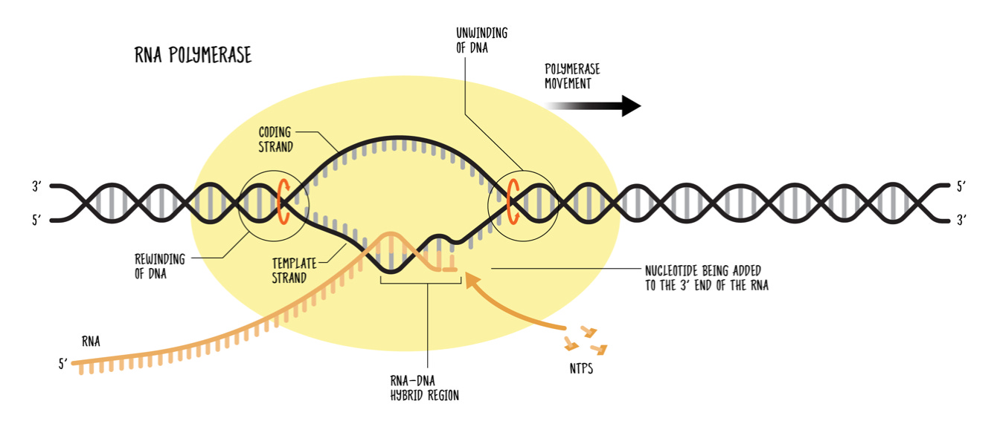

The mRNA is then translated into a functional protein with the help of ribosomes and transfer RNA (tRNA), as shown in the image below ([image source](https://en.wikipedia.org/wiki/Transfer_RNA)). Gene expression is a tightly regulated process that allows cells to respond to environmental cues, perform specific functions, and adapt to changing conditions. Not all genes are expressed at all times, and the expression level can vary between different cell types, tissues, and developmental stages. In other words, genes can be differentially expressed, which refers to the ability of genes to be "turned on" or "turned off" in response to specific factors or changes in the cellular environment.

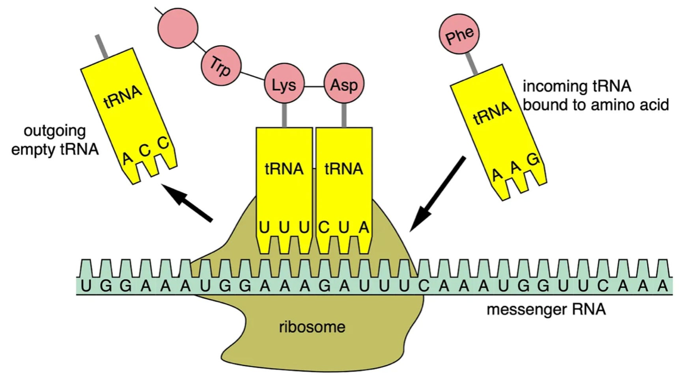

Differential expression analysis is a fundamental technique in bioinformatics used to identify differentially expressed genes between two or more biological conditions, such as healthy and diseased tissues, or before and after a treatment. To perform differential expression analysis, we must perform statistical analysis to discover quantitative changes in expression levels between experimental groups. For example, we use statistical testing to decide whether, for a given gene, an observed difference in read counts is significant, that is, whether it is greater than what would be expected just due to natural random variation.

**How Do We Know Genes Are Differentially Expressed?**

Differential expression analysis aims to understand how gene expression levels change under different conditions, providing insights into the molecular mechanisms underlying biological processes. Before performing differential expression analysis, we need to quantify gene expression levels. This can be done with RNA sequencing (RNA-seq) and microarrays, which are used to identify genes being actively transcribed. RNA-Seq, a cutting-edge technique, reads the entire transcriptome, providing a nuanced and dynamic understanding of gene activity. In contrast, microarrays, akin to genetic snapshots, capture a snapshot of gene expression levels at a given moment. 

After obtaining gene expression data, we can assess differential expression by comparing the expression of genes under different experimental conditions. For example, researchers might compare gene expression in healthy and diseased tissues or in the presence and absence of a specific treatment, or they may investigate expression under different environmental conditions. A gene is considered upregulated if its expression increases by a statistically significant degree in a particular condition and downregulated if its expression decreases by a statistically significant degree. 

## 🧫 Loading Data & Exploratory Data Analysis

The data from this study were made available via the Gene Expression Omnibus under the accession number [GSE95077](https://www.ncbi.nlm.nih.gov/geo/query/acc.cgi?acc=GSE95077).  To access this data, I used Bash's ```wget``` command, which allows you to download files from the internet using the HTTP, HTTPS, or FTP protocols. 

In the code block below, I'll demonstrate how to access the count matrix data from this study, which contains a measure of gene expression for every gene in each cell line sample, and how to decompress the data using Bash's ```gunzip``` command:
```bash
wget -O GSE95077_Normalized_Count_Matrix_JJN3_Amiloride_and_CTRL.txt.gz 'https://www.ncbi.nlm.nih.gov/geo/download/?acc=GSE95077&format=file&file=GSE95077%5FNormalized%5FCount%5FMatrix%5FJJN3%5FAmiloride%5Fand%5FCTRL%2Etxt%2Egz'

gunzip GSE95077_Normalized_Count_Matrix_JJN3_Amiloride_and_CTRL.txt
```
Following that, I'll show you how to import the libraries needed for this project and how to load the count matrix data into a Pandas DataFrame:
```python
# import libraries
import matplotlib.pyplot as plt
import pandas as pd
from scipy.cluster.hierarchy import dendrogram, linkage
import gseapy as gp
import numpy as np
import seaborn as sns
from scipy.stats import ttest_ind
from statsmodels.stats.multitest import multipletests
from sklearn.preprocessing import StandardScaler
from scipy.spatial.distance import pdist, squareform
from scipy.cluster.hierarchy import linkage, dendrogram, fcluster

# define the file path, load the data into a DataFrame, and view the first 5 rows
path = 'GSE95077_Normalized_Count_Matrix_JJN3_Amiloride_and_CTRL.txt'
data = pd.read_csv(path, sep='\t', index_col=0)
data.head()
```
Which, produces the following output:

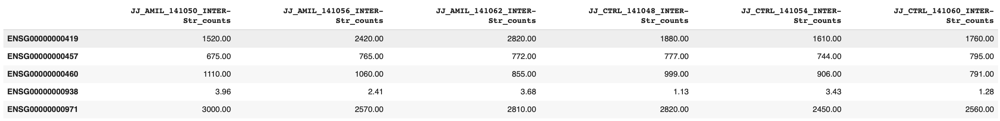

The data frame above is indexed by gene ID (ENSG), and then there are six columns of RNA-sequencing expression data (i.e., counts). The first three columns contain expression counts for the control group, and the last three columns contain expression counts for the experimental group (i.e., the amiloride treatment group). Note that both groups use the JJN3 cell line, which was established from the bone marrow of a 57-year-old woman with plasma cell leukemia.

Next, we'll want to perform preliminary data analysis to understand the distribution and variability of RNA sequencing counts across the samples and check for missing data before performing any downstream analysis. First, let's check out the sample quality:
```python
# check for missing values and get summary statistics 
print(data.isnull().sum())
print(data.describe())
```
Which, produces the following output:

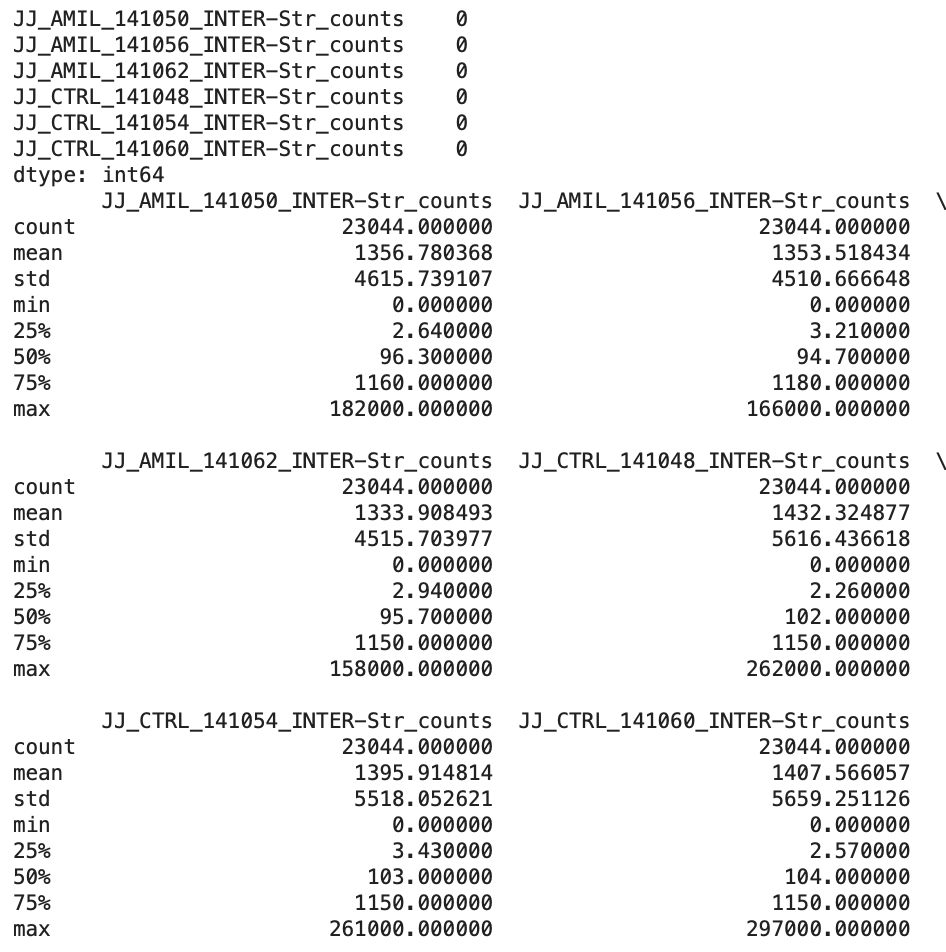

Notably, the dataset has no null (missing) values, and all samples' total counts (i.e., gene IDs) are the same. Next, we'll explore the distribution and variability in the dataset, as demonstrated in the code block below:
```python
# calcualte total counts per sample and log transform counts
total_counts = data.sum(axis=0)
log_counts = data.apply(lambda x: np.log2(x + 1)) #+1 ensures zero counts are transformed to log2(1) = 0 instead of being undefined

# create subplots
fig, axes = plt.subplots(1, 2, figsize=(18, 6))

# subplot 1: total counts per sample
axes[0].bar(data.columns, total_counts, color='skyblue')
axes[0].set_ylabel('Total Counts')
axes[0].set_title('Total Counts per Sample')
axes[0].tick_params(axis='x', rotation=85)

# subplot 2: log transformed counts per sample
log_counts.boxplot(ax=axes[1])
axes[1].set_ylabel('Log2(Counts + 1)') 
axes[1].set_title('Log Transformed Counts per Sample')
axes[1].tick_params(axis='x', rotation=85)

plt.tight_layout()
plt.show()
```
Which produces the following output:

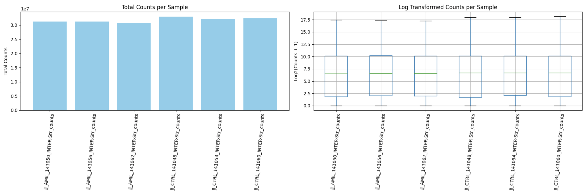

The chart on the left, titled "Total Counts," helps visualize the overall sequencing depth across the samples. Ideally, the bars, representing the total counts, should be of similar height, indicating that sequencing depth is consistent across samples, which is the case with this data set. 

Conversely, the rightmost chart is used to assess the variability and distribution of gene expression counts across samples. In this case, we can see that the boxes, representing the interquartile range, and the whiskers, representing variability outside the upper and lower quartiles, are of similar sizes across the samples, indicating a consistent data distribution. 

Now, before moving on to quality control and filtering, we'll use one last visualization to explore the similarity, or dissimilarity, between our six samples:
```python
# perform hierarchical clustering and create dendrogram
h_clustering = linkage(log_counts.T, 'ward')
plt.figure(figsize=(8, 6))
dendrogram(h_clustering, labels=data.columns)
plt.xticks(rotation=90)
plt.ylabel('Distance')
plt.show()
```
Which produces the following output:

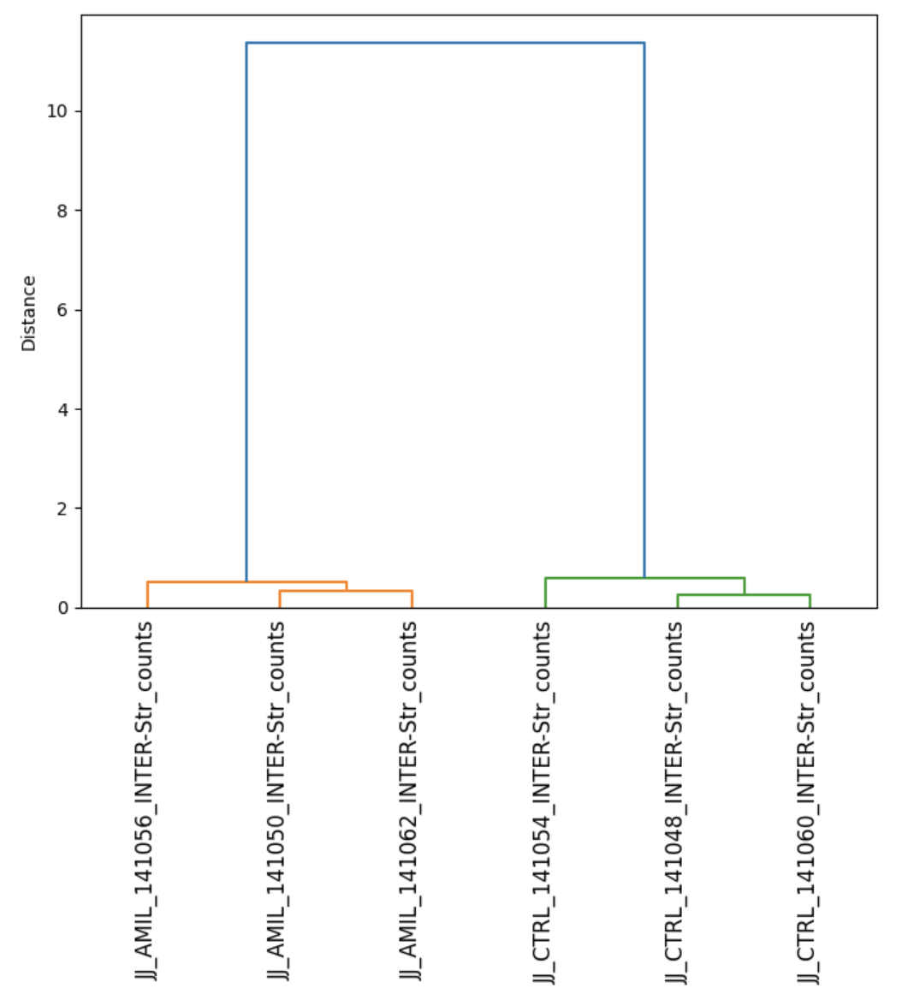

The image above shows the results of hierarchical clustering, which can be visualized via a dendrogram. When viewing a dendrogram, special attention should be paid to the cluster groupings and branches. Samples clustered together are more similar to each other, and the length of the branches (vertical lines) connecting clusters represents the distance or dissimilarity between clusters. 

The chart above shows that our three control samples are clustered on the left, whereas our three experimental (i.e.,m amiloride-exposed) samples are clustered together on the right. This is a good sign, suggesting that the control and experimental groups are distinct and that there is biological variation between the two groups of samples. Thus, we can feel confident that our downstream differential expression analyses will provide meaningful results. 

## 🧫 Quality Control, Filtering, and Normalization

The next step in our analysis is to filter out genes with low expression levels across all samples, which can introduce noise in the data. By filtering these out, you can make your results more reliable and improve your statistical power, making detecting real biological differences between conditions easier. Additionally, filtering out genes with low expression counts decreases computational load by reducing the number of genes in your dataset, making future downstream analyses faster. In the code block below, I'll show you how perform basic filtering and normalization:
```python
# create function to normalize and filter genes 
def filter_genes(data, min_cpm=1, min_samples=3):
    cpm = data.apply(lambda x: (x / x.sum()) * 1e6) 
    mask = (cpm > min_cpm).sum(axis=1) >= min_samples 
    return data[mask]
# filter genes 
data = filter_genes(data)
```
Now, let's break this code down step by step to see how it works:

- In the code block above, the ```filter_genes``` function normalizes the gene expression data to CPM (counts per million), then filters out genes that do not meet the criteria for minimum expression across a sufficient number of samples, thus achieving normalization and filtering in one swoop.
- CPM is a common normalization method used to account for differences in library sizes across samples. It works by scaling the raw counts to a common unit, allowing comparisons across samples. In the code block above, ```cpm = data.apply(lambda x: (x / x.sum()) * 1e6) ``` uses a lambda function. For each row (i.e., gene), the lambda function divides each value (i.e., count) by the sum of counts for that gene across all samples, then multiplies the result by 1*10^6, converting raw counts into CPM. 
- Then, ```mask = (cpm > min_cpm).sum(axis=1) >= min_samples``` identifies genes that have sufficient expression across a minimum number of samples, which helps retain genes that are sufficiently expressed in a significant number of samples. First, ```(cpm > min_cpm)```creates a boolean DataFrame where True indicates that the CPM for a given gene is greater than ```(min_cpm```. Then, ```.sum(axis=1)``` sums these boolean values across samples for each gene, resulting in the count of samplers where the gene's expression exceeds ```min_cpm```. Finally, ```>=min_samples``` checks if this count is greater than or equal to ```min_samples```, creating a boolean series where True indicates the gene meeting the filtering criteria. 
- Finally, ```return data[mask``` returns the subset of the original data that meets the filtering criteria. After calling this function with the code ```data = filter_genes(data)```, the result is that the data set is filtered from 23,044 genes down to 13,335 genes, significantly reducing the noise in the dataset. 

## 🧫 Differential Expression Analysis
Now that we've loaded our data and performed quality control and normalization, we can perform differential expression analysis. In this case, I used a pairwise analysis, which involves comparing gene expression levels between individual pairs of control and experimental samples. For example, I compared control sample 1 to experimental sample 1, control sample 2 to experimental sample 2, etc. 

Pairwise analyses are useful when working with small sample sizes, as we currently are. Additionally, pairwise comparison can be more precise because it compares matched samples, reducing variability caused by biological differences between samples and batch effects. In the code block below, I'll demonstrate how to perform a pairwise analysis, multiple testing corrections, and how to identify differentially expressed genes:
```python
results = []
for gene in data.index:
    control = data.loc[gene, ['JJ_AMIL_141050_INTER-Str_counts', 'JJ_AMIL_141056_INTER-Str_counts', 'JJ_AMIL_141062_INTER-Str_counts']]
    treated = data.loc[gene, ['JJ_CTRL_141048_INTER-Str_counts', 'JJ_CTRL_141054_INTER-Str_counts', 'JJ_CTRL_141060_INTER-Str_counts']]
    mean_control = np.mean(control)
    mean_treated = np.mean(treated)
    log2fc = np.log2((mean_treated + 1) / (mean_control + 1))  # Adding 1 to avoid log of 0
    t_stat, p_val = ttest_ind(control, treated)
    results.append({'gene': gene, 'log2fc': log2fc, 't_stat': t_stat, 'p_val': p_val})

results_df = pd.DataFrame(results)

results_df['p_adj'] = multipletests(results_df['p_val'], method='fdr_bh')[1]

results_df['abs_log2fc'] = results_df['log2fc'].abs()

deg = results_df[(results_df['p_adj'] < 0.01) & (results_df['abs_log2fc'] > 1)]
```
The code above performs a differential expression analysis on gene expression data, and the final output, ```deg```, is a DataFrame containing the genes that are significantly differentially expressed between the control and treated samples. Now, let's break this code down step by step to see how it works:

- First, ```results = []``` initializes an empty list to store the results of the t-tests and fold change calculations for each gene.
- Then, ```for gene in data.index:``` initializes a for loop to iterate over each gene in the dataset (recall, ```data.index:``` contains the gene identifiers for this dataset).
    - Next, ```control = data.loc[...etc]``` and ```treatment = data.loc[...etc]``` uses Panda's loc[] method to extract the expression levels for each gene in both the control and treatment samples.
    - Following that, ```mean_control = np.mean(control)``` and ```mean_treated = np.mean(treated)``` calcualte the mean expression level for the control and treatment samples, then ```log2fc = np.log2((mean_treated + 1) / (mean_control + 1))``` computes the log2 fold change (the +1 is to avoid taking hte og of zero, which is undefined).
    - Then, ```t_stat, p_val = ttest_ind(control, treated)``` performs an independent t-test to determine is there is a statisically significant differnce in the expression levels between the control and treatment samples, and ```results.append(...etc)``` appends the gene's identifier, log2 fold change, t-statistic, and p-value to the results list.
- After that, ```results_df = pd.DataFrame(results)``` convert the results list into a pandas DataFrame.
- Then, ```results_df['p_adj'] = multipletests(results_df['p_val'], method='fdr_bh')[1]``` adjusts the p-values for multiple testing, using the Benjamini-Hochberg method, and ```results_df['abs_log2fc'] = results_df['log2fc'].abs()``` calculates the absolute value of the log2 fold change for each gene and stores it in a new columns labeled ```abs_log2fc```.
- Finally, ```deg = results_df[(results_df['p_adj'] < 0.01) & (results_df['abs_log2fc'] > 1)]``` filters the genes and retains only those that meet the following criteria: a adjusted p-value less than 0.01, and an absolute log2 fold change greater than 1. 

Note - I chose to use a p-value threhsold of 0.01 instead of 0.05 to make my analysis more stringent and reduce the number of false positives. Whether this is appropriate depends on the specific context and the trade-off between sensitivity (detecting true positives) and specificity (avoiding false positives) that you are willing to accept. In this case, I know that a p-value cutoff of 0.01 may result in us missing some truly differentially expressed genes because the threshold is more stringent.

Now that we have a list of differentially expressed genes, we can sort them based on their absolute log2 fold change and adjusted p-value, then display the results for the top 25 genes, as demonstrated below:
```python
top_genes = deg.sort_values(by=['abs_log2fc', 'p_adj'], ascending=[False, True])
top_25_genes = top_genes.head(25)
print(top_25_genes[['gene', 'abs_log2fc', 'p_adj']])
```
Which produces the following output:

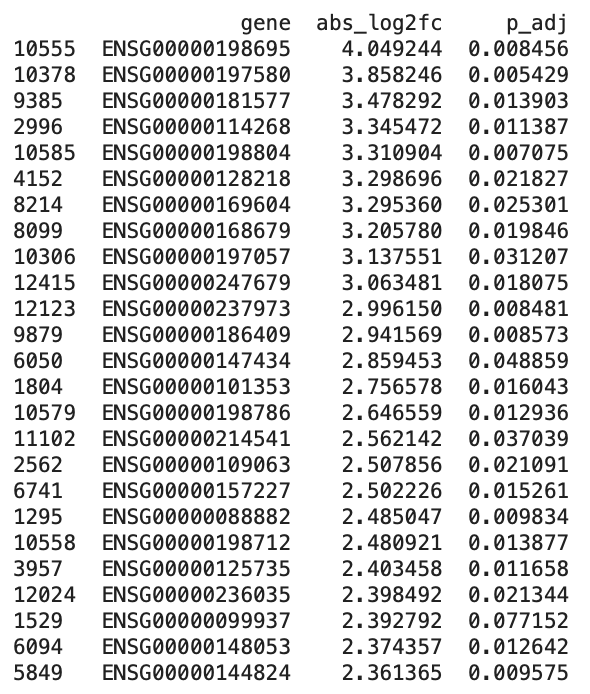

Notably, the image above displays absolute log2 fold changes, which measure the magnitude of change without regard to direction. This type of visualization is useful when you are interested in genes that show significant changes in expression, regardless of whether they are upregulated or downregulated. However, it's not particularly useful for understanding a drug's mechanism of action. Thus, in the next section, we'll stratify genes by their adjusted p values and log2 fold changes to understand whether they are up and down-regulated and to what degree that is significant. 

## 🧫 Visualizing Differentially Expressed Genes
The first visualization we'll use to understand our data is a volcano plot. A volcano plot is a type of scatter plot commonly used in genomics and other areas of bioinformatics to visualize the results of differential expression analysis and help identify statistically significant changes in gene expression between different conditions. In the code block below, I'll demonstrate how to create a volcano plot using our data frame of filtered differentially expressed genes. The first plot will be from our ```results_df``` DataFrame before filtering, then the second plot will be from our ```deg``` DataFrame, a 
after filtering out genes that do not meet our selection criteria:
```python
plt.figure(figsize=(8, 6))
sns.scatterplot(data=results_df, x='log2fc', y='p_adj', hue='log2fc', palette='viridis', alpha=0.9, edgecolor=None)
plt.axhline(y=0.01, color='red', linestyle='-', linewidth=1) 
plt.axvline(x=1, color='blue', linestyle='-', linewidth=1)  
plt.axvline(x=-1, color='blue', linestyle='-', linewidth=1) 
plt.xlabel('log2 Fold Change')
plt.ylabel('Adjusted P-value')
plt.legend(title='log2 Fold Change', loc='lower left')
plt.show()
```
Which, produces the following output:

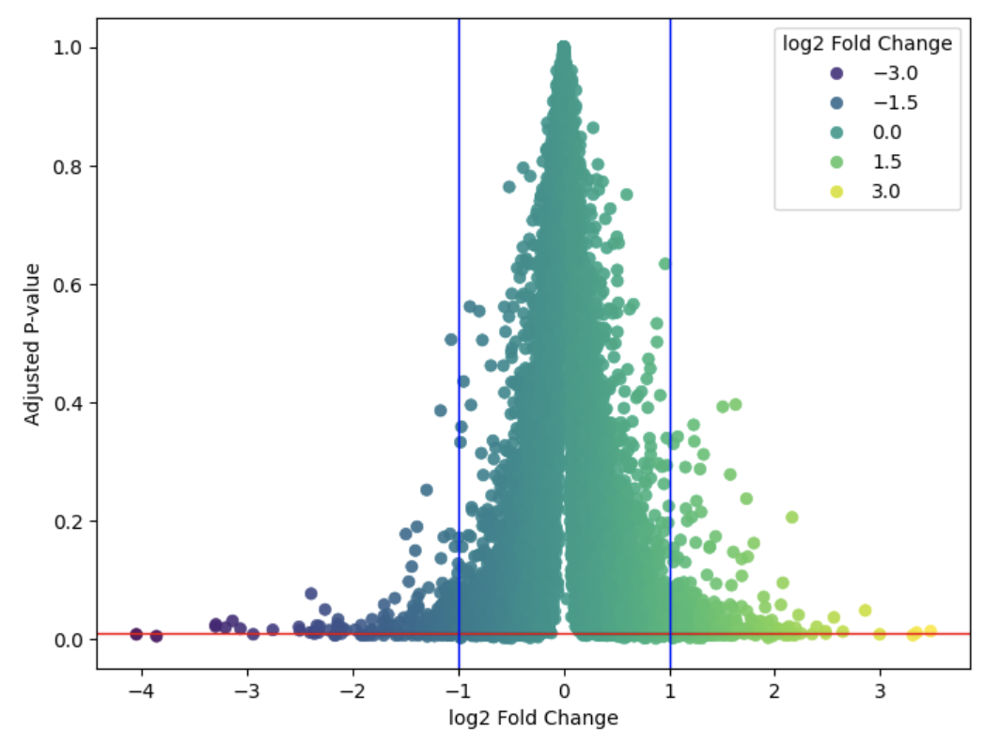

As you can see in the image above, our volcano plot combines two critical pieces of information for each gene: the magnitude of change (fold change) and the statistical significance (p-value) of that change. Specifically, the x-axis on this graph shows the log2 fold change between the control and experimental samples in our pairwise analysis. A positive value indicates an upregulation of a gene in the experimental group compared to the control, and a negative value represents downregulation of a gene in the experimental group compared to the control. Additionally, the y-axis shows the significance of said change in gene expression. Thus, when viewing this graph, we are most interested in the two boxes formed in the lower left and lower right corners, which represent down-regulated and up-regulated genes with high statistical significance. 

Now, in the code block below, I'll show you how to produce a volcano plot containing only genes that met our filtering criteria:
```python
plt.figure(figsize=(8, 6))
sns.scatterplot(data=deg, x='log2fc', y='p_adj', hue='log2fc', palette='viridis', alpha=0.9, edgecolor=None)
plt.axhline(y=0.01, color='red', linestyle='-', linewidth=1) 
plt.axvline(x=1, color='blue', linestyle='-', linewidth=1)  
plt.axvline(x=-1, color='blue', linestyle='-', linewidth=1) 
plt.xlabel('log2 Fold Change')
plt.ylabel('Adjusted P-value')
plt.legend(title='log2 Fold Change', loc='lower left')
plt.show()
```
Which, produces the following output:

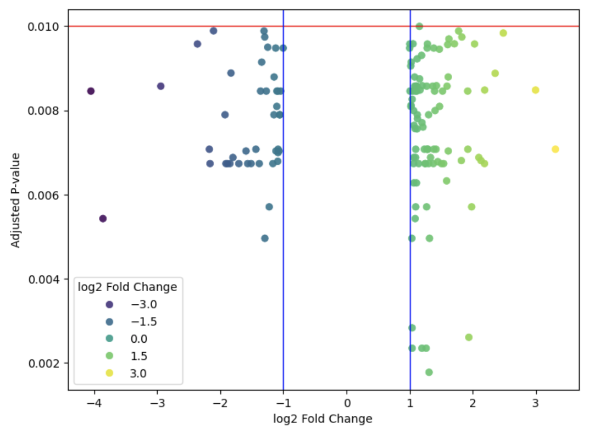

Notably, the data in this second volcano plot is much more sparse, as it only contains genes that met our filtering criteria of an adjusted p-value <0.1 and a log2 fold change >1. However, this plot does little to show us how these genes are related to one another, which will help us unravel amiloride's physiological effects. To better understand that, we can perform hierarchical clustering, which can help us understand how genes with differential expression are related and identify clusters of genes that may be similarly affected by the drug treatment.

The first hierarchical clustering visualization we'll explore is a heatmap, which provides an integrated view of the data, showing not only how samples or features group together but also the magnitude of their values. In this code block below, I'll show you how to create this type of visualization:
```python
significant_genes = deg['gene'].tolist()
data_sig = data.loc[significant_genes]
scaler = StandardScaler()
data_sig_scaled = pd.DataFrame(scaler.fit_transform(data_sig.T).T, index=data_sig.index, columns=data_sig.columns)
sns.clustermap(data_sig_scaled, method='ward', cmap='viridis', metric='euclidean', figsize=(10, 10), dendrogram_ratio=(0.2, 0.2))
plt.show()
```
Which produces the following output:

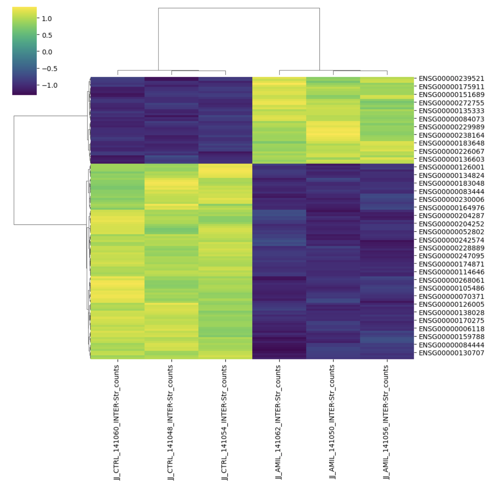

Looking at the figure above, you should note that the rows and columns are clustered by sample and fold change. The three leftmost columns correspond to the control samples, and the three rightmost columns correspond to the experimental samples. In contrast, the y-axis is grouped based on whether genes were up or downregulated. For example, in the top right corner of the plot, you'll find genes whose expression was elevated in the experimental sample compared to the control sample. In the bottom left corner, you'll find genes whose expression was lower in the experimental sample compared to the control sample. 

Additionally, the colors in the plot represent the magnitude of change, as described in the key in the upper left corner of the image. This chart also features both x-axis and y-axis dendrograms. The x-axis dendrogram at the top of the image clusters the samples by condition, whereas the y-axis dendrogram clustered genes based on their expression profiles and similarity. Because the dendrograms appended to the heatmap above are difficult to visualize, I've provided another code block below to generate a standalone dendrogram for visualizing the hierarchical clustering of differentially expressed genes:
```python
significant_genes = deg['gene'].tolist()
data_sig = data.loc[significant_genes]
scaler = StandardScaler()
data_sig_scaled = pd.DataFrame(scaler.fit_transform(data_sig.T).T, index=data_sig.index, columns=data_sig.columns)
distance_matrix = pdist(data_sig_scaled, metric='euclidean')
linkage_matrix = linkage(distance_matrix, method='ward')
dendrogram(linkage_matrix, labels=data_sig.index, orientation='top', distance_sort='descending')
plt.figure(figsize=(20, 7))
plt.ylabel('Distance')
plt.ylim(0, 3)
plt.xticks(rotation=90)  
plt.tight_layout()  
plt.show()
```
Which produces the following output:

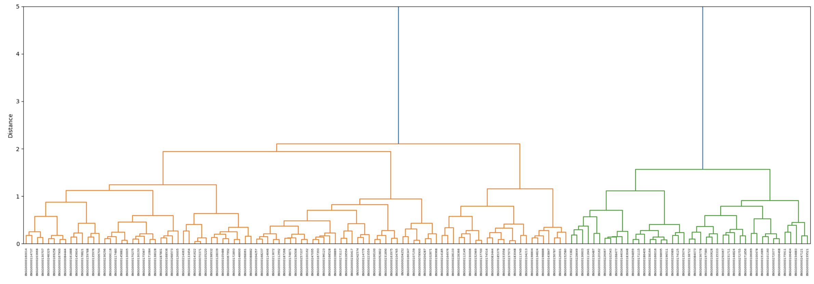

When viewing the dendrogram above, there are three main points to focus on: the branches, the leaves, and the clusters. The branches are depicted as vertical lines, and the height at which two branches merge indicates the distance between the clusters. Thus, clusters connected by longer branches are more dissimilar to one another than clusters connected by shorter branches. In addition to branches, we have the leaves, which are the endpoints of the branches that correspond to individual genes. Now, when looking at the whole chart, we can see that leaves are part of hierarchical clusters. At the macro level, we have two main clusters representing genes that are down-regulated and up-regulated, respectively. Then, we have multiple layers of smaller nested clusters within each of those clusters. 

In general, genes are grouped in clusters based on their expression profiles across samples, and thus, genes with similar expression profiles are more likely to be clustered together. Additionally, genes with similar functions or involved in related biological processes tend to cluster together as well (though this isn't always the case). 

## 🧫 Conclusion: What is Amilioride's Mechanism of Action? Is It Effective?

In the last section, we saw that amiloride upregulates and downregulates a myriad of genes to a statistically significant degree. Additionally, we performed hierarchical clustering to group a number of these genes together to better understand amiloride's mechanisms of action and effects. 

Notably, several oncogenes, such as ALDOA, PH4B, EE1A, and CD74, were down-regulated in the experimental group compared to the control group, recapitulating the results of several preclinical studies exploring the potential anticancer effects of amiloride. For example, in the paper [Amiloride, An Old Diuretic Drug, Is a Potential Therapeutic Agent for Multiple Myeloma](https://aacrjournals.org/clincancerres/article/23/21/6602/259285/Amiloride-An-Old-Diuretic-Drug-Is-a-Potential) the investigators found that amilioride decreased cell growth in vitro, and that amilioride induced significant apoptosis in myeloma cells 24 and 48 hours folling treatment, as depicted in the image below:

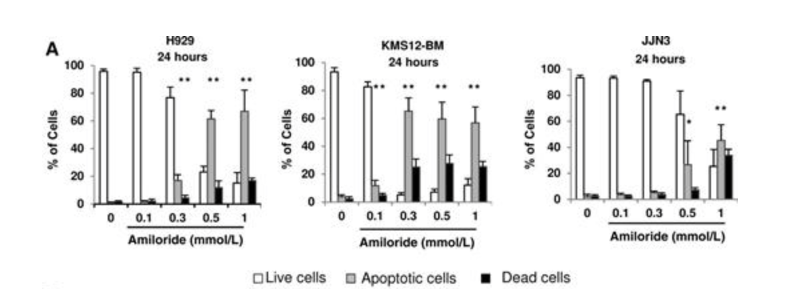

However, our analyses also show that amiloride significantly increased the expression of genes such as CGREF1, among many others, which have been shown to have both tumor-suppressive and oncogenic functions depending on the context. As a result, we need to be very careful when analyzing gene expression data, particularly when thousands of genes are differentially expressed between control and experimental (i.e., treatment) samples, many of which have redundant or contradictory effects. 

This can be explained by the fact that drugs can affect multiple signaling pathways simultaneously, and the effects of a drug can also vary depending on the specific cancer type and its microenvironment. For example, a drug might activate a pathway that enhances tumor suppressor gene expression while also inadvertently activating pathways that lead to increased oncogene expression. Additionally, in some cancers, the same drug might enhance the expression of genes with both tumor-suppressive and oncogenic roles, depending on the tumor's molecular characteristics and stage. As a result, it's important to integrate other data sources when trying to understand a drug's mechanism of action, physiological effects, and effectiveness. 

#
[1] Rojas EA, Corchete LA, San-Segundo L, Martínez-Blanch JF et al. Amiloride, An Old Diuretic Drug, Is a Potential Therapeutic Agent for Multiple Myeloma. Clin Cancer Res 2017 Nov 1;23(21):6602-6615. PMID: 28790111

## Accessibility 
You can access a copy of the Juypter notebook with all of my code from this project repository [here](https://github.com/evanpeikon/GSE_95077/blob/main/code/GSE95077.ipynb). Alternativley, you can access section specific code blocks from this README [here](https://github.com/evanpeikon/GSE_95077/tree/main/code/code_blocks).


